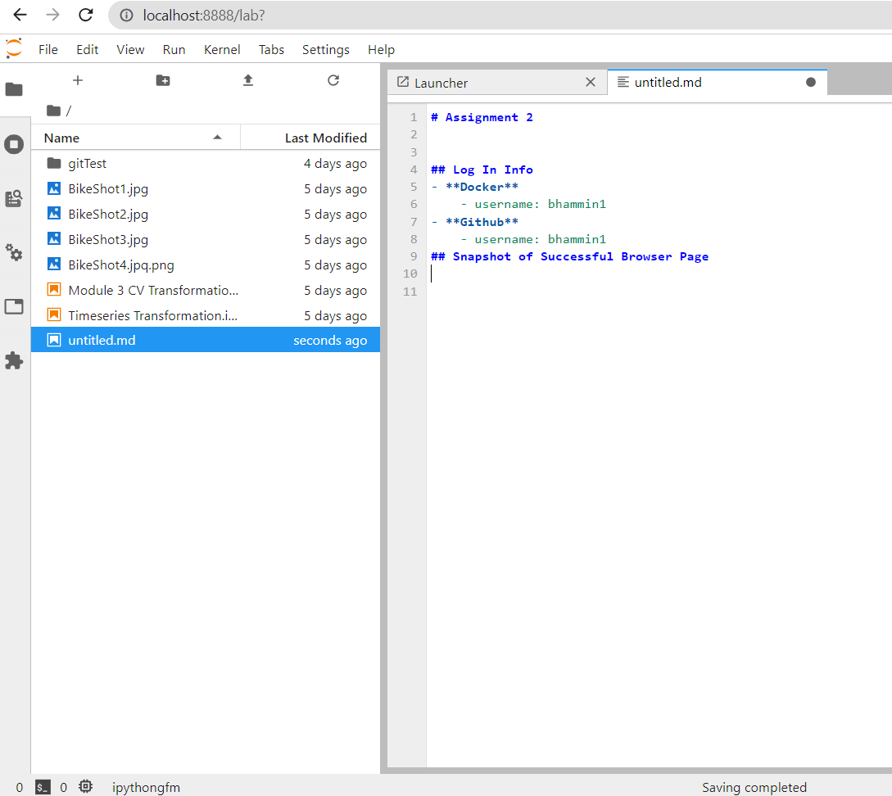

# README - Assignment 2

## Log In Info
- **Docker**
    - username: bhammin1
- **Github**
    - username: bhammin1
- **Class Repo**
    - https://github.com/bhammin1/ai_portfolio_summer23.git
    
## Snapshot of Successful Browser Page

## The Notebook
- The notebook performs pre-processing on 4 bike images
- Functions can be reused for other images
- The notebook performs the following tasks
    - Loads the images
    - Normalizes the images
    - Resizes the images
    - Stores all images into a single list 
## Steps
- Docker
    - The docker image used is a version of the class base image
        - [mod3 docker image](https://hub.docker.com/repository/docker/bhammin1/creating-ai-enabled-systems/general)
        - Pull Image
            - `docker pull jhebeler/classtank:705.603.jupyterlab`
        - Running the image
            - `docker run --restart=unless-stopped -it -p 8888:8888 -p 8787:8787 -p5000:5000 -v c:/workspace:/rapids/notebooks/workspace jhebeler/classtank:705.603.jupyterlab`
            - Then to start Jupyter lab
                - `cd /rapids/notebooks/workspace`
                - `jupyter lab --no-browser --ip=0.0.0.0 --allow-root`
                - Then pull the git repo
                    - `git pull https://github.com/bhammin1/ai_portfolio_summer23.git`
- To run the notebook, run all cells in order of the notebook. 
- No additional packages needed if using the base docker image.